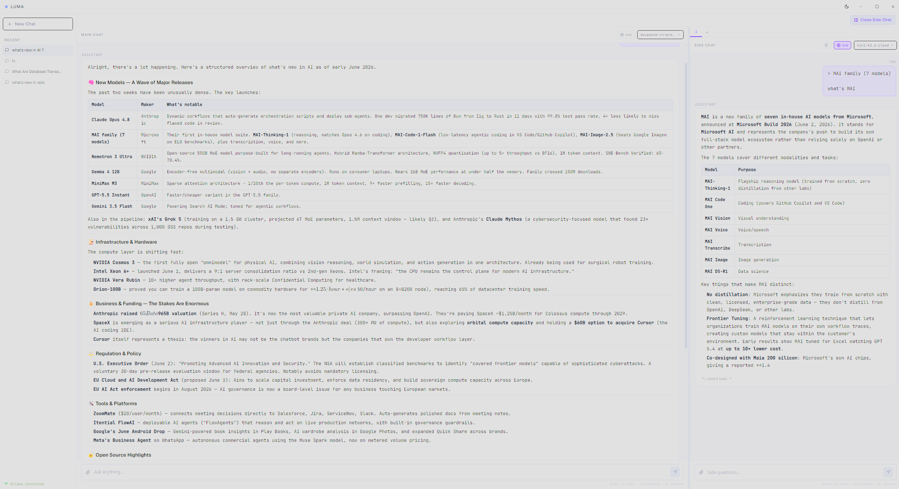

# Luma



A research workbench for deep-dive topic exploration, built as a dual-pane desktop app on top of local LLMs. The main chat is the spine of a research session, and side chats are branches for drilling into subtopics and sources — with live web search and fetch so the model can ground its answers.

- **Stack:** Electron + React/Vite + SQLite + [Ollama](https://ollama.com)
- **Not a general chatbot:** every capability exists to help a user research and deeply understand a topic. See `ROADMAP.md` for the long-term plan.

## Features

### Layout
- **Dual-pane layout** — main chat on the left, resizable side panel on the right
- **Resizable side panel** — drag the divider to resize
- **Sidebar** — session list with persistent history

### Side chat as first-class research branch
- **Auto context bridge** — the side chat automatically receives the main chat's conversation as context, so you can ask follow-up questions about main-chat responses without losing the main thread
- **Side chats are isolated** — drilling into a subtopic in a side chat doesn't disturb the main conversation
- **Pre-filled prompts** — opening a side chat from a main message prefills a research-focused prompt

### Models
- **Multi-model support** — switch models per pane, independent of the other
- **Local + cloud** — uses any Ollama-served model, including Ollama Pro cloud models

### Streaming & control
- **Token-by-token streaming** — see the response build as the model generates
- **Stop button** — cancel mid-generation

### Vision
- **Image attachments** — file picker or clipboard paste (Ctrl/Cmd+V) into either pane
- **Vision-capable models** — any Ollama model that supports image input works automatically

### Research tools (tool-calling)
The model can call tools as it responds, with full visibility into the process:
- **`web_search(query)`** — DuckDuckGo search, no API key required. Returns titles, URLs, snippets.
- **`web_fetch(url)`** — fetch a URL and extract clean readable content via Mozilla Readability
- **`get_current_time()`** — local time + timezone

Web tools run in the Electron main process (no CORS, network code stays in one auditable place) and are exposed to the renderer over IPC. The tool-call loop is capped at 5 rounds per response to prevent runaway iteration. The `ToolActivity` component shows a live indicator (`🔍 Searching for "..."`, `📖 Reading article...`) plus a collapsible summary of every tool used for that response.

### Search controls
- **Per-pane web search toggle** — disable web tools in either pane for sessions that don't need them. The renderer filters the tool list before passing it to the model.

### Persistence
- **SQLite via Electron main** — sessions, messages, and side chats are stored locally (better-sqlite3) and restored on launch
- **No cloud sync** — research is the user's private work, not a collaborative product
- **Migrations** — `ALTER TABLE` upgrades run on init inside a try/catch so existing DBs upgrade gracefully

### Theming
- **Light & dark themes** — toggle in the title bar; choice persists in `localStorage`, with `prefers-color-scheme` fallback
- **Tailwind CSS** — utility classes for layout and components

## Requirements

- [Ollama](https://ollama.com) running locally on `http://localhost:11434`
- Node.js 18+

## Getting Started

```bash
npm install
npm run dev
```

`npm install` runs `postinstall`, which rebuilds `better-sqlite3` against Electron's Node ABI — leave it alone unless you know why you're skipping it.

## Build

```bash
npm run build
```

Runs `vite build` then `electron-builder`, outputting an NSIS installer to `dist-electron/`.

## Architecture

The app runs as two strict processes:

- **Main process** (`electron/`) — owns the SQLite DB, the BrowserWindow, and all outbound HTTP (web search/fetch). The renderer cannot reach it directly.
- **Renderer** (`src/`) — React UI. Talks to the main process only through bridges exposed by `electron/preload.js`: `window.electron`, `window.db`, `window.webTools`. New main-side capabilities need a channel in `electron/ipc.js`, a mirror in `preload.js`, and a thin client wrapper in `src/lib/db.js` or equivalent.

State lives in three independent Zustand stores. None of them persist to `localStorage`; durability is the DB's job.

| Store | File | Owns |
|---|---|---|
| `useMainChat` / `useSideChat` | `src/store/chatStore.js` | Per-pane messages, streaming state, tool-call records (same factory) |
| `useSessionStore` | `src/store/sessionStore.js` | Session list, side-chat metadata — the only store that writes to SQLite |
| `useUiStore` | `src/store/uiStore.js` | Theme, sidebar open state, Ollama connectivity, per-pane web-search toggle |

## Stack

- **Electron 31** — desktop shell with `contextIsolation: true`, `nodeIntegration: false`
- **React 18 + Vite 5** — UI and dev server
- **Zustand 4** — state management
- **better-sqlite3 12** — synchronous local persistence (main process only)
- **Tailwind CSS** — utility classes
- **Ollama API** — local and cloud model inference
- **react-markdown + remark-gfm + remark-math + rehype-katex** — message rendering
- **@mozilla/readability + cheerio + jsdom** — clean article extraction in the main process
- **lucide-react** — icons

## Project layout

```
ollama-chat/
├── electron/             Main process: DB, window, IPC, web tools
│   └── tools/            search.js, fetch.js, html.js (web tools)
├── src/                  Renderer: React UI
│   ├── components/       ChatPane, SidePanel, Sidebar, InputArea, MessageBubble, ToolActivity…
│   ├── hooks/            useStreamingChat, useDbInit, useChatSession
│   ├── lib/              ollama.js, tools.js, db.js, systemPrompt.js
│   └── store/            chatStore, sessionStore, uiStore, appStore
├── index.html, vite.config.mjs, tailwind.config.js, postcss.config.js
└── package.json
```

See `ROADMAP.md` for what's planned next and what's deliberately out of scope.

## License

MIT
